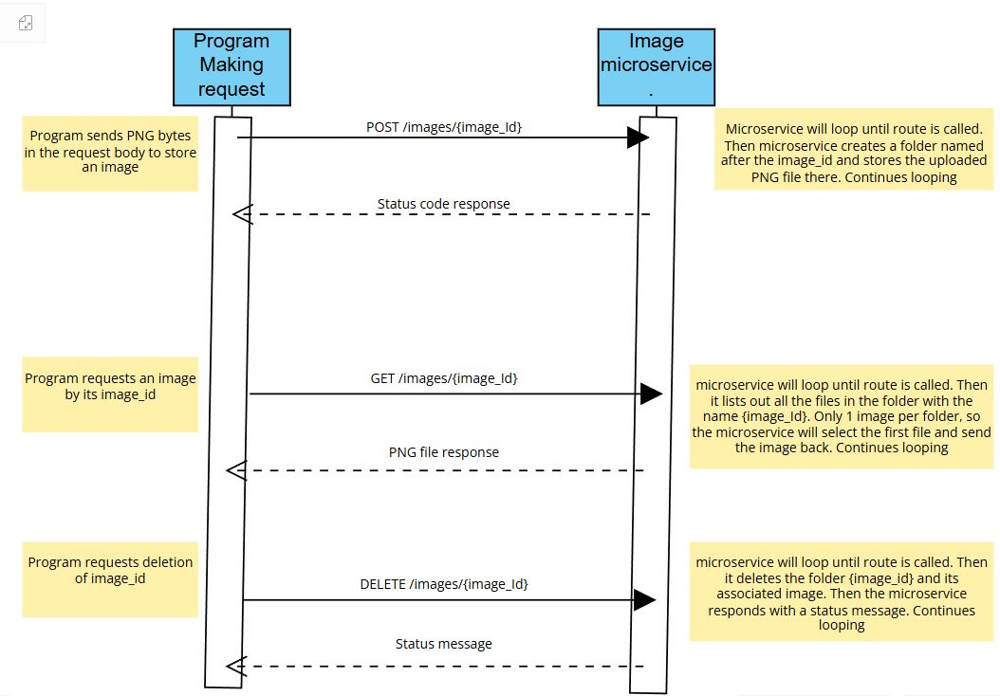

# CS361-Image-Microservice Communication Contract
This Microservice stores, retrieves and deletes images stored locally

A1. Retrieve an image - Returns an image file for the specified image_ID found at the end of the url
     Example Call: requests.get(http://127.0.0.1:8080/images/68faf55b66e7685d4e5a7ab)
A2. Post an image - uploads the image "files" as see in the example call with the given image_ID. The example
     call is showing the image_Id is TestPost
     # Note: in this call, files needs to be a raw PNG image file
     Example Call: requests.post([url](http://127.0.0.1:8080/images/TestPost), files=files)
 A3.Delete an image - will remove the image with the given Image_Id.... The example is showing the Image_Id is TestPost
     Example Call: requests.delete(http://127.0.0.1:8080/images/TestPost)

  B. When a program makes a request to retrieve an image from this microservice, it will receive the raw PNG image bytes in the
     HTTP response. The calling microservice can either write that data to a file to be viewed or just render the image 
     in memory to display it without saving the data.

     Example call GET: 
     url = 'http://127.0.0.1:8080/images/68faf55b66e7685d4e5a7ab'
     response = requests.get(url)
     os.makedirs("TestGet", exist_ok=True)
     with open("TestGet/test_image.png", "wb") as f:
        f.write(response.content)
    
       This code will sucessfully get an image from the image.py microservice and copy the contents to a "TestGet" folder on
       the client side

      Example call POST:
      url = 'http://127.0.0.1:8080/images/TestPost'
      with open("TestGet/test_image.png", "rb") as f:
        files = {"file": f}
        response = requests.post(url, files=files)

        This code will sucessfully add the test image from the "TestGet" folder to the images directory with "TestPost" being
        the {image_Id}
       
      Example call DELETE:
      url = 'http://127.0.0.1:8080/images/TestPost'
      response = requests.delete(url)

      This code will delete the directory "TESTPOST" that was added from the test POST call.

     Example of client side that uses the various microservice routes. NEED TO BE RUN IN-ORDER
     if __name__ == "__main__":
         #test_get()
         #test_post()
         #test_delete()
      
  C: 
  

