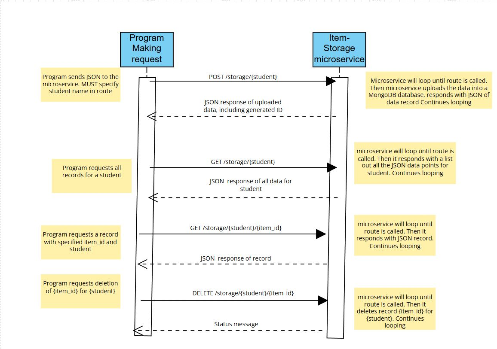

# CS361-Item-Storage_Microservice
This Microservice stores, retrieves and deletes data json stored in a MongoDB database. All data is isolated per team member using the {student} parameter

A: Example call POST: 
data_being_uploaded = {
  "Name": "Some Name",
  "Value": "Some Value"
}
response = requests.post('http://127.0.0.1:8000/storage/zack', json=data_being_uploaded)

Example call GET (all):
response = requests.get('http://127.0.0.1:8000/storage/zack')

Example call GET (one item):
item_id = 691924238139b9492aeb4db1
response = requests.get('http://127.0.0.1:8000/storage/zack/' + item_id)

Example call DELETE:
response = requests.delete('http://127.0.0.1:8000/storage/zack/' + item_id)


B: Example POST: when the main program posts data, the response might look like: 
{
  "student": "zack",
  "itemId": "691924238139b9492aeb4db1",
  "data": {
    "Name": "Some Name",
    "Value": "Some Value"
  }
}


Example GET (all) response for "student" set to zack:
```
[
    {
        "data": {
            "TestParam1": "Test1",
            "TestParam2": "Test2",
            "TestParam3": "Test3"
        },
        "itemId": "691924238139b9492aeb4db1"
    },
    {
        "data": {
            "TestParam1": "Test1",
            "TestParam2": "Test2",
            "TestParam3": "Test3"
        },
        "itemId": "691924278139b9492aeb4db2"
    }
]
```
C




